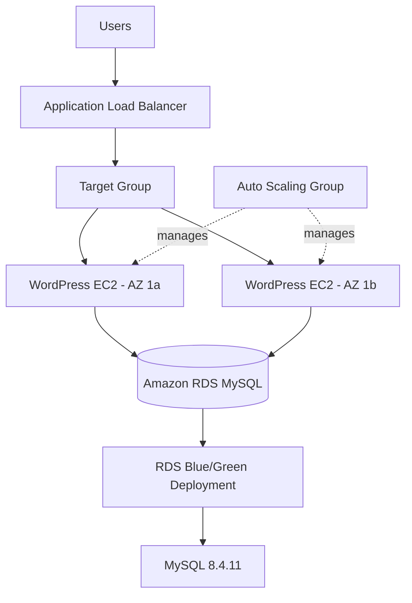

# AWS WordPress Infrastructure - Architecture

```mermaid
flowchart TD
    U[Users] --> ALB[Application Load Balancer]
    ALB --> TG[Target Group]

    TG --> EC2A[WordPress EC2 - AZ 1a]
    TG --> EC2B[WordPress EC2 - AZ 1b]

    ASG[Auto Scaling Group] -. manages .-> EC2A
    ASG -. manages .-> EC2B

    EC2A --> RDS[(Amazon RDS MySQL)]
    EC2B --> RDS

    RDS --> BG[RDS Blue/Green Deployment]
    BG --> NEW[MySQL 8.4.11]
```
